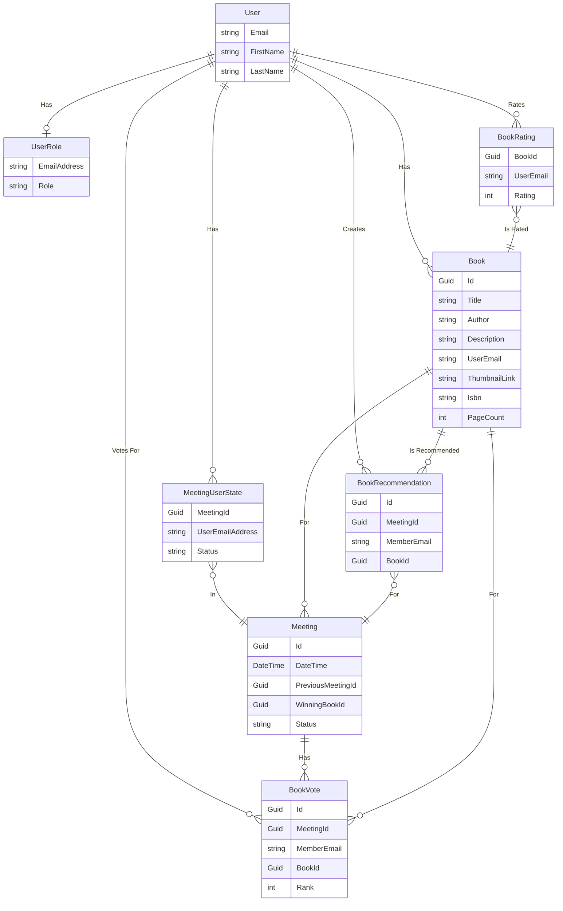

# Welcome to the Citrus Book Club 

    

The best book club in the bustling metropolis of Lancaster, Pennsylvania. Most of our meetings take place at a member's house on Lemon Street, or sometimes Orange Street - hence the name!

The test site is hosted at [test.citrusbook.club](https://test.citrusbook.club/).

## Background

This application was created to help us organize and has the following features:

- Authentication via Google OAuth
- Add books to your "bookshelf" from which you can recommend a book for the group to read in the next meeting
  - This consumes the Google Books API to search for books, making it easy to add books to your shelf (usually)
- Meetings: set a date and time for the next meeting
- Voting: During a meeting, members can vote on which book to read next. We use the [Borda Count ranked-choice method](https://en.wikipedia.org/wiki/Borda_count) to determine the winner
- Ratings: after voting, members can rate the previously winning book from 0-10. The average rating is displayed at the end of the meeting

## Technical Details

This application uses the following tech stack:

- **Frontend**: Angular 17, Bootstrap 5, ngRx for state management
- **Backend**: ASP.NET 8
- **Database**: PostgreSQL (via EF Core)
- **Containerization**: Docker
- **Logging**: Serilog and Seq
- **Hosting**: At my house!

## Backend Architecture

The backend is a REST API built with ASP.NET 8, with a squeeze of SignalR (websockets) for real-time communication in the voting area.

## Planned Features

[See issues on Github!](https://github.com/lwestfall/CitrusBookClub/issues)

## What are areas for improvement?

This project was meant to be simple and I am the only maintainer / contributor, so I skipped some of the usual practices and there are a few areas that could be improved. All of these topics are ones I have professional experience with.

- On the backend, I didn't implement a layered architecture. I'm very familiar with Clean Architecture, and I could implement that easily here.
- There is no test automation implemented currently
- Hosting is done at home to keep costs at zero, but I could easily deploy to Azure, AWS, or GCP
- There are some UI/UX improvements that could be made, such as better error handling and loading states
- The third-party package I'm consuming for Google OAuth has some bugs (e.g. login doesn't persist longer than an hour). I've meant to fork it and fix them, but haven't yet
- I don't deal with version numbers, ideally I would use semantic versioning and have a CI/CD pipeline to automatically increment the version number
- Roles are implemented in a very basic way in the database, but I could use a more robust solution like IdentityServer

## ERD

